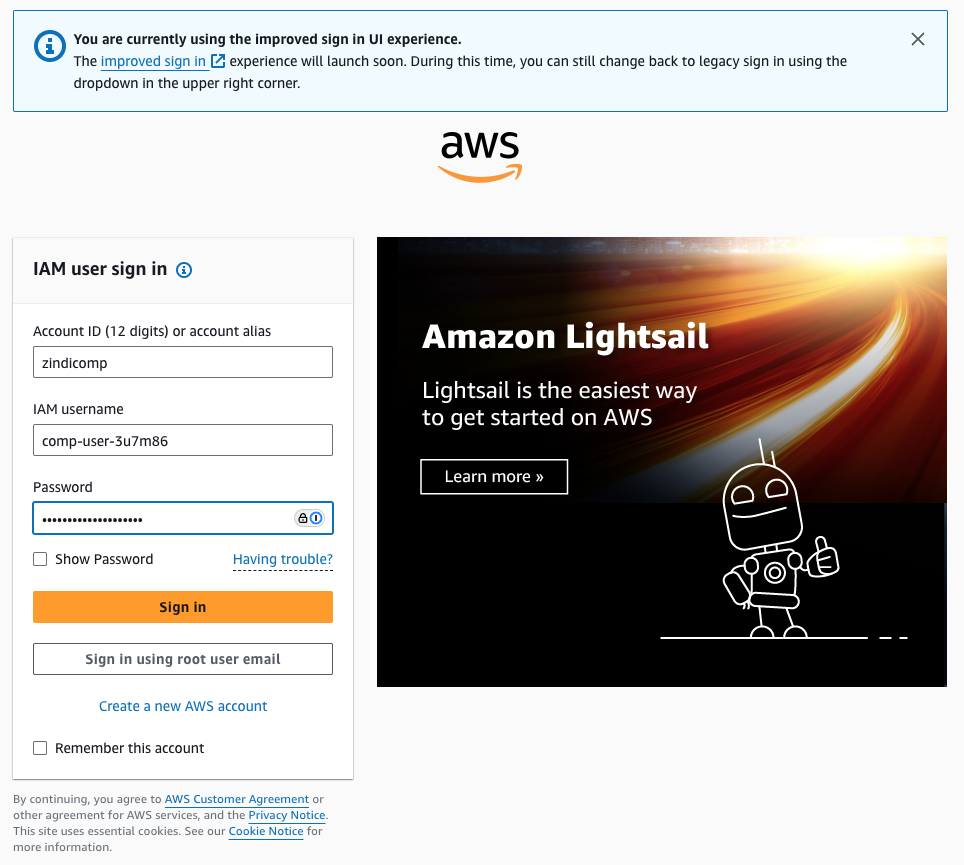
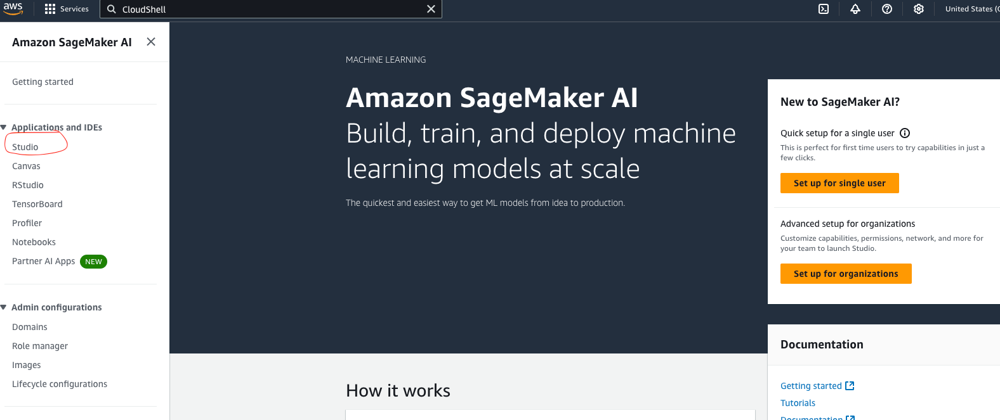

# AWS Console Login Instructions

## Quick Access

The easiest way to access the AWS Console is to use this direct link:
[https://zindicomp.signin.aws.amazon.com](https://zindicomp.signin.aws.amazon.com)

This link will automatically fill in the account ID (869935100875).

## Login Details

1. **Account ID**: Either enter `869935100875` or `zindicomp`
2. **IAM Username**: Your competition username in the format `comp-user-XXXXXX`
3. **Password**: Your assigned password

## After Login

Once logged in, you'll see the AWS Console. To access SageMaker:

1. Make sure you're in the **US East (Ohio)** region
2. Click "Services" and search for "SageMaker"
3. Click "Studio" in the left navigation
4. Select your domain and username
5. Click "Open Studio"

## Troubleshooting

If you cannot log in:

1. Double check your username format: `comp-user-XXXXXX`
2. Verify you're using the correct account ID: `869935100875` or `zindicomp`
3. If still having issues, contact Zindi support to verify your credentials

## Security Notes

- Never share your AWS credentials with anyone
- Always log out when finished
- Use only the US East (Ohio) region
